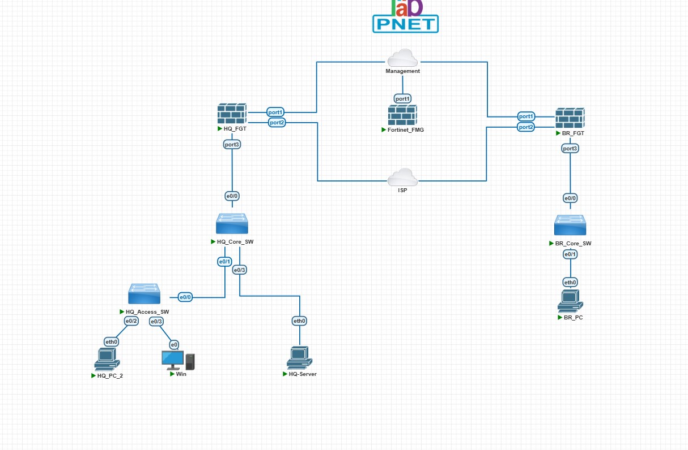

# Centralized Enterprise Network

## 📌 Project Overview
This project demonstrates the design, implementation, and centralized management of a secure, future-proof enterprise network edge using the **Fortinet Ecosystem**. Managed entirely via **FortiManager**, the architecture transitions a traditional static-routed topology into an abstracted, scalable **SD-WAN** fabric while enforcing strict application control policies.

This environment was deployed  within a virtualized sandbox hypervisor, mimicking real-world data center and branch deployment workflows.

---
### VLAN Allocations
* **VLAN 10 (Data Plane)**: Assigned for internal corporate client and desktop compute resources.
* **VLAN 20 (Servers Plane)**: Dedicated out-of-band management tier hosting critical core assets including the FortiManager appliance.
* **VLAN 30 (Branch_Data Plane)**: Dedicated out-of-band management tier hosting critical core assets including the FortiManager appliance.

### Device IP Address Assignments

| Node Name | Physical/Logical Interface | IP Address Assignment | Purpose / Description |
| :--- | :--- | :--- | :--- |
| **Fortinet_FMG** | Port 1 | `192.168.192.131/24` | [cite_start]Centralized Policy & Object Manager (NSE 5 Platform) [cite: 335, 340] |
| **HQ_FGT** | Port 1 (Managment) | `192.168.192.137/24` | [cite_start]Primary Hub Firewall (External Transport Gate) [cite: 335] |
| **HQ_FGT** | Port 2 (wan) | `dynamic 10.0.137.117/24` | Remote Spoke Site-02 Firewall Edge |
| **HQ_FGT** | Port 3.10(HQ-Data) | `10.10.10.254/24` | [cite_start]Default Gateway for VLAN 10 Data Networks [cite: 152] |
| **HQ_FGT** | Port 3.20(GQ-Servers) | `10.20.20.254/24` | [cite_start]Default Gateway for VLAN 20 Management Networks [cite: 152, 188] |
| **HQ_Core_SW** | VLAN 20 SVI | `10.20.20.1/24` | Core Infrastructure Switching Management IP |
| **Branch_FGT** | Port 1 (Management) | `192.168.192.136/24` | Remote Spoke Site-01 Firewall Edge |
| **Branch_FGT** | Port 2 (wan) | `dynamic 10.0.137.15` | Remote Spoke Site-02 Firewall Edge |
| **Branch_LAN** | Port 3.30 (BR-Data) | `10.30.30.254/24` range | [cite_start]Internal Spoke Subnets Managed via Dynamic Mapping [cite: 44] |

## 2. Infrastructure Boot Initialization Matrix (PNetLab Optimization)

[cite_start]Due to virtualized resource constraints and device startup behavior in sandboxed environments, specific execution states must be met to avoid DHCP leases or FGFM tunnel dropouts. The nodes should be activated in this sequential order:

1.  **Phase I: Cisco Infrastructure Layer (`HQ_Core_SW` & `HQ_Access_SW` & `BR_Core_SW`)** *Objective*: Establish initial 802.1Q trunks and let Spanning Tree Protocol (Rapid-PVST) transition to a stable forwarding state.
2.  **Phase II: Security Gateways & Orchestration (`HQ_FGT` & `Fortinet_FMG` & `BR_FGT`)** *Objective*: Ensure the firewall’s local interfaces are initialized and the FortiManager FGFM daemon is actively listening for registration traffic on TCP port 541.
3.  **Phase III: Client Endpoint Tier (`HQ_PC_1` / `Windows VM`)** *Objective*: Prevent endpoints from timing out and assigning APIPA addresses (`169.254.x.x`) by ensuring DHCP server processes are awake on the upstream firewalls.

---

## 3. Site-to-Site IPsec VPN Tunnel Architecture

An overlay mesh is engineered between **HQ_FGT (Hub)** and **Branch_FGT (Spoke)** to securely pass internal private traffic over untrusted simulated WAN transport boundaries.

## 4. Centralized Management (FortiManager)
* Separated configuration database management from live execution by maintaining separate **Device Settings** and **Policy Packages**.
* Utilized the consolidated deployment wizard to maintain a single source of truth for the edge environment.

## 5. High-Performance WAN Edge (SD-WAN)
* Abstracted the physical internet interface (`port2`) into a virtual **`sdwan` interface zone** to ensure future-proof multi-homed ISP expansion without firewall policy disruption.
* Maintained traffic shaping benchmarks with configured traffic metrics ($100\text{ Mbps}$ Symmetric bandwidth baselines).
* Configured automated **Performance SLAs** tracking latency and packet loss against public infrastructure (`8.8.8.8`) to govern automated path monitoring.

## 6. Layer 7 Next-Generation Security
* **Application Control:** Designed and implemented a strict application policy blocking bandwidth-wasting, high-risk, and social media platforms (e.g., explicit blocking of `facebook.com`).
* **SSL Inspection Integration:** Applied customized flow-based inspection profiles to ensure deep packet inspection over encrypted HTTPS handshakes without breaking underlying application traffic.
* **Security & Routing Synchronicity:** Re-engineered traditional default gateway routing rules to map directly to the `sdwan` interface while binding granular firewall policies to the SD-WAN zone structure.

---
